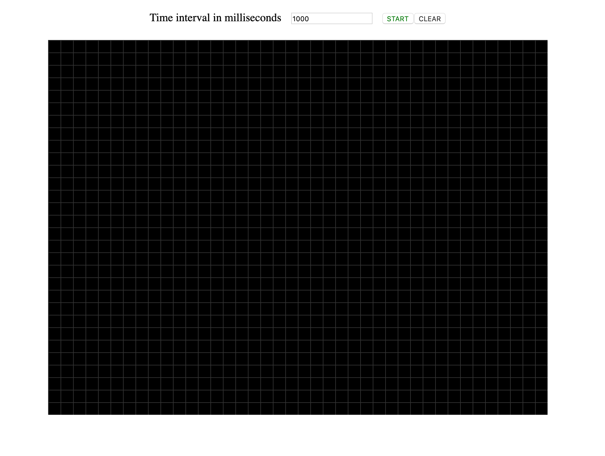
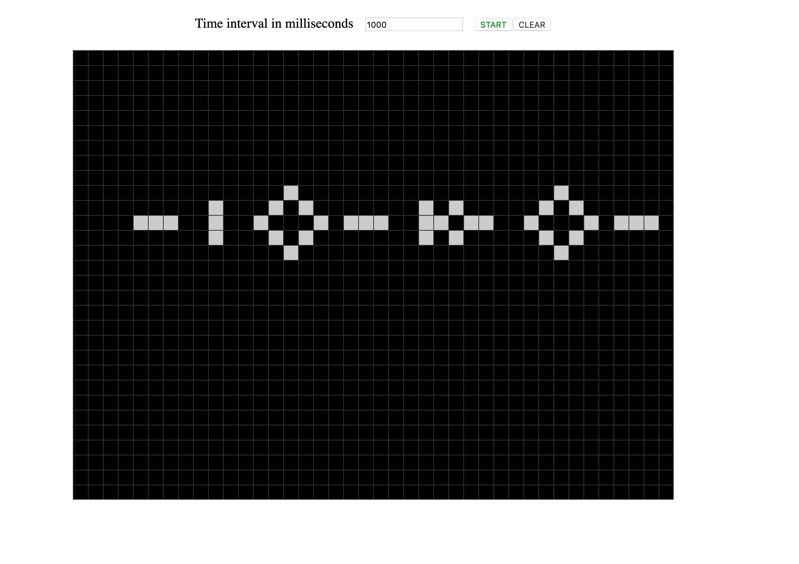

Following the tutorial on https://www.freecodecamp.org/news/create-gameoflife-with-react-in-one-hour-8e686a410174/

### Language : 
-   ReactJs
-   yarn

### Run the project locally 
Clone it and in the project directory run
```
yarn start
```

### Snaps

#### StartingBoard



<br/>
<br/>

#### GamePlay

